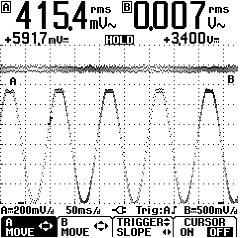
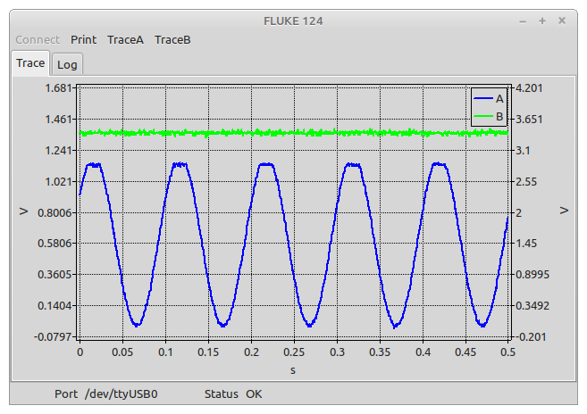

# fluketrace
Acquire and display signal traces for Fluke 120 series oscilloscopes.

## Usage
### Connect
Connect to Fluke 120 series via serial-USB cable.  When the menu is clicked, a small form pops up where a serial port can be selected from a dropdown list of possible ports.

### Screen capture
Copies the screen content as a postscript image.  The resulting image is usually low quality, and in an old format. So far gimp seems like the only software that load the image.  The screen image is stored in the current folder in a file called screengrab.ps.  The image is also converted to PNG format which is also saved in the current folder as screengrab.png:

### TraceA/TraceB
Pulls the data for trace A or B as applicable. An attempt is made to scale the data in a similar manner used on the display, but this only works if first trace A then trace B is pulled.  If trace B is pulled before trace A the left and right scales may not line up properly. If both traces needs to be collected it is "better" to press "hold" on the oscilloscope, else trace B may not contain the maximum number of data points.

### Notes
The maximum serial baud rate is 19200, which gives a data transfer rate of about 1920 bytes/s. This is relatively slow and in particular the screen capture action will take a long time (~ 45 seconds) to transfer the 60 kB of data.  

To achieve proper scaling of the left and right axes requires first acquiring trace A data then trace B data.
